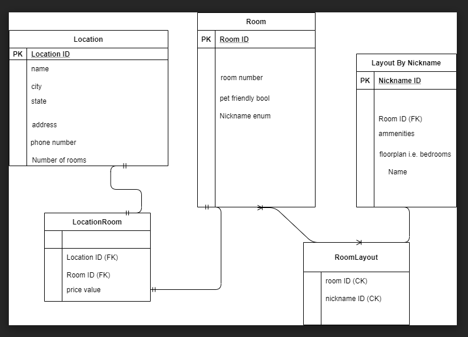

# Lab11 Async Hotel

**Author**: Scott Falbo

**Version**: 1.0.0 

## Overview
A relational database for use in a hotel chain.

## Getting Started
nothing to start yet

## Example
 

## Architecture
+ Location - LocationRoom 1:many   -    number of rooms can have many options.
+ LocationRoom - Room  1:1   one room number to one price
+ Room - RoomLayout  many:many  because many room numbers have many layouts
+ RoomLayout - Layout  many:many, same as above, its through a join table.

+ Location
  + Using a joint entity table to with foreign keys to Locations and Room, getting the RoomLayout data and price.
+ Room
  + Table that holds room number and gets the rest of its data, based on the room number, from Layout through the join table.
  + Has a nickname enum that holds all of the options.
+ LocationRoom
  + Joint Entity Table with a payload.  Connects Location to Rooms, and has the logic for price.
+ RoomLayout
  + Pure join table connecting Room and Layout
+ Layout (by nickname)

## Change Log
+ *01/25/2021 - 5:45pm* - Finished the worlds worst ERD and half way understand what is happeing.